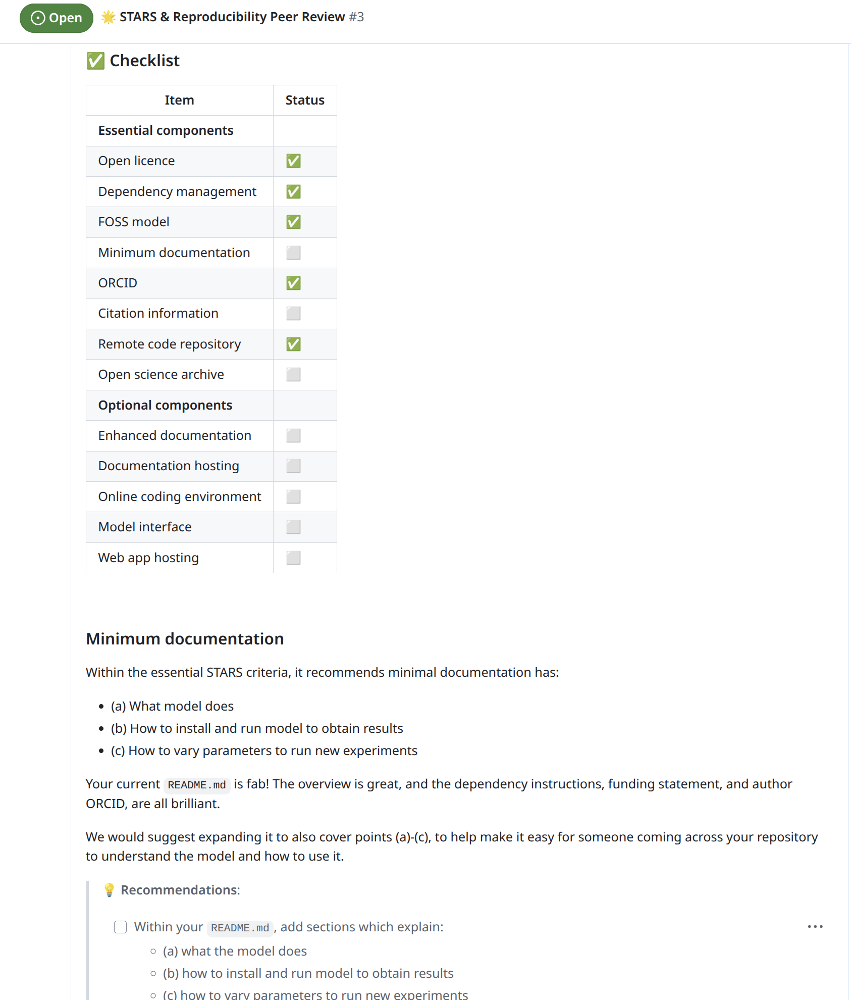

In **May 2025** and **February 2026**, I was invited to review two existing simulation models.

## Hybrid simulation modelling for orthopaedics

The model is available at:

> Matthew Howells , Paul Harper , Daniel Gartner , Geraint Palmer  (2025) Hybrid Simulation Modelling for Orthopaedics. GitHub. <https://github.com/MHowells/HybridSimModel>.

It combines:

* A system dynamics model used to model patient deterioration while waiting for a GP referral to primary care.
* A DES model used to model the patient journey through an orthopaedic department.

It is summarised in the poster "[Clinical Pathway Modelling of a Trauma and Orthopaedics Department](https://github.com/MHowells/SW25_poster)" from the OR Society's 12th Simulation Workshop (SW25) conference

I reviewed the model repository, providing the review as a [GitHub issue](https://github.com/MHowells/HybridSimModel/issues/3) (and an accompanying [pull request](https://github.com/MHowells/HybridSimModel/pull/2)). The review was structured into:

* A review summary.
* Feedback from running the code (e.g., dependency management, code troubleshooting).
* Evaluation against the STARS framework for model reuse.
* Evaluation against the STARS reproducibility recommendations.

::: {.callout-note title="Example snapshot from review" collapse="true"}

:::

## Nurse staffing simulation

The model is available at:

> Tolusha Dahanayake Yapa , Peter Griffiths , Tom Monks , Chiara Dall'Ora , Ezekwesiri Nwanosike , Natalie Pattison , Christina Saville  (2026). Nurse Staffing Simulation Paper. GitHub. <https://github.com/TolushaDYapa/NurseStaffingSimulation_Paper>.

I attempted to reproduce results in the draft paper, recording results in a [GitHub issues](https://github.com/TolushaDYapa/NurseStaffingSimulation_Paper/issues/1) and providing pull requests with some suggested changes.

This supported the addition of an environment file with all required dependencies, and identified a missing analysis script required for creating the paper tables.
