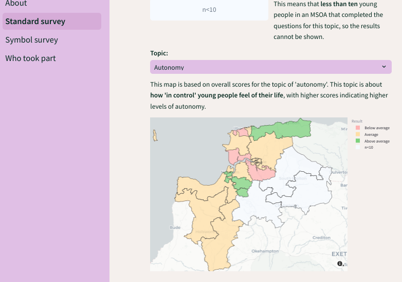
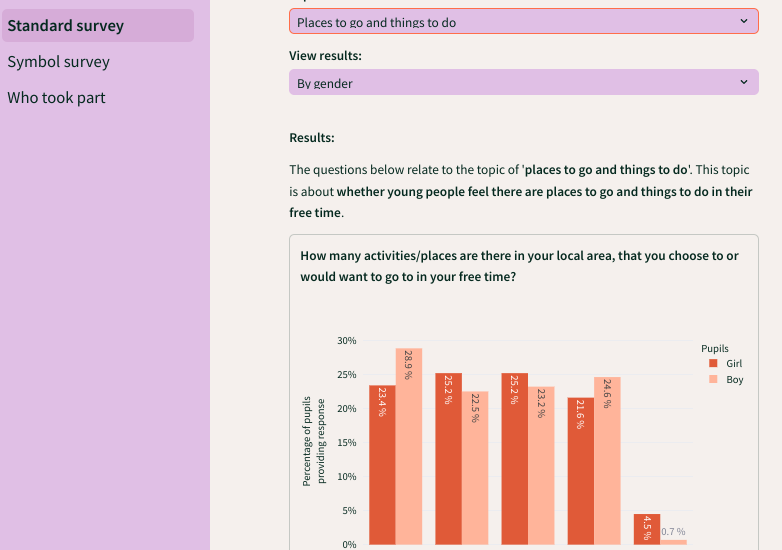
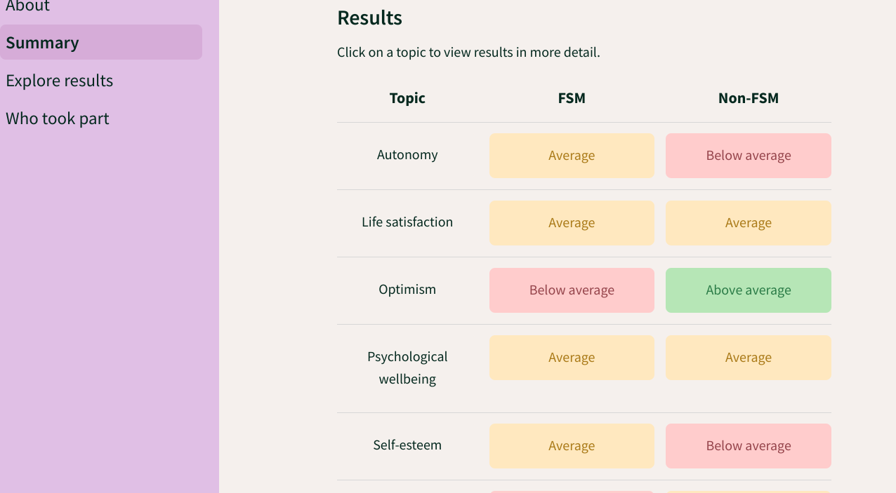
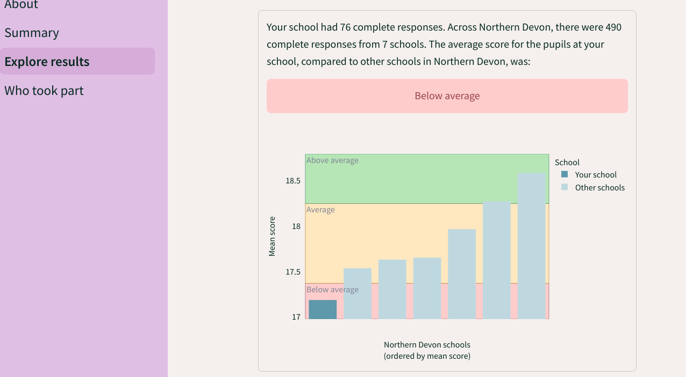

I worked on Kailo from **October 2022 to April 2024**. My role was related to set-up and delivery of the #BeeWell survey, and the creation of dashboards to share results with schools and other stakeholders. #BeeWell was a school-based wellbeing survey being completed by secondary school pupils in Northern Devon in the academic year 2023-24. There were two versions of the survey - a standard survey being delivered at seven mainstream schools, and a symbol version being delivered at two non-mainstream schools.

The video below provides a helpful introduction to the survey. It was designed to introduce young people to the survey. You can find out more about the survey at <https://kailo.community/beewell/>.



We planned to share results from the survey will be shared using dashboards (with dashboards for school-level and area-level dashboards). These are publically available with synthetic data. These have been produced using Streamlit.

* GitHub repository: [https://github.com/kailo-beewell](https://github.com/kailo-beewell)
* Package used to produce dashboards: [kailo-beewell-dashboard](https://github.com/kailo-beewell/kailo_beewell_dashboard_package).
* Streamlit dashboards:
    * Standard survey school dashboard - 
    * Symbol survey school dashboard - 
    * Area-level dashboard - 

I published a pre-registration on the Open Science Framework ([10.17605/OSF.IO/85BVN](https://doi.org/10.17605/OSF.IO/85BVN)) describing the the analysis plans for the dashboards, with two components describing each of the standard and symbol surveys.

My time on this project ended during the survey collection window. At this point, several schools had begun successfully completing the survey, and I had developed three synthetic dashboards which were very nearly complete. Before leaving, I spent a few months explaining the survey and dashboards to two colleagues at Dartington Service Design Lab, who took over the survey delivery and analysis from the point when I left the project. As such, I am no longer responsible for maintenance of these dashboards.

Exemplar screenshots from dashboards:

  
   

  
   

