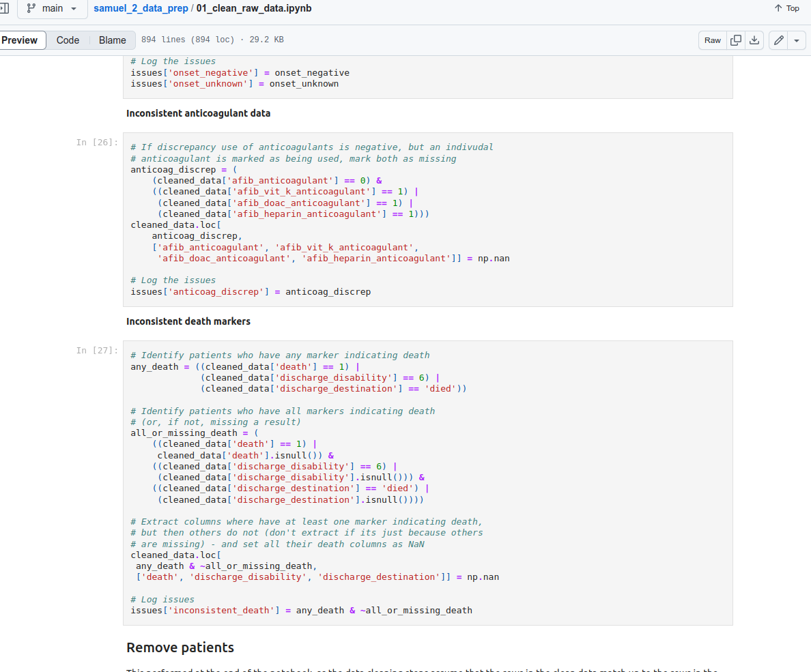
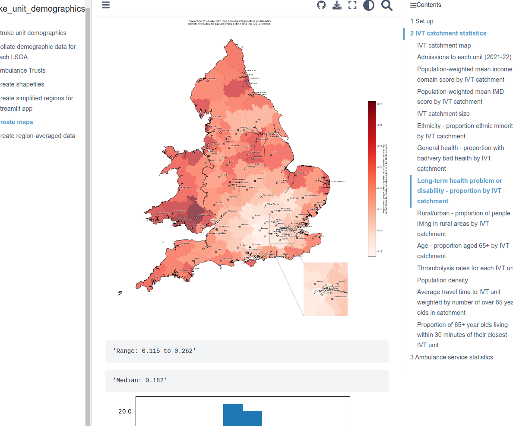

I worked on a few tasks for the SAMueL2 project in **Spring 2023**, supervised by **Mike Allen**. These were:

* Data cleaning and descriptive analysis of SSNAP data ([repository](https://github.com/samuel-book/samuel_2_data_prep))
* Demographics of emergency stroke unit catchment areas ([repository](https://github.com/samuel-book/stroke_unit_demographics), [website](https://samuel-book.github.io/stroke_unit_demographics/03_create_maps.html))

  
  

